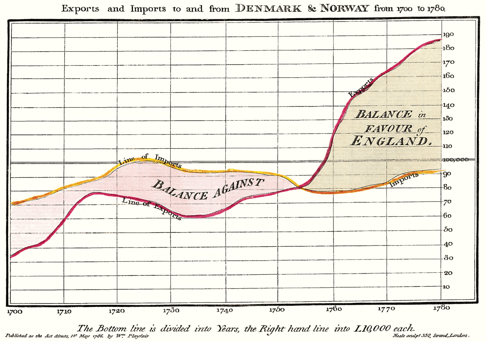

# Building

All commands are run from the root of the project, from a terminal:

| Command           | Action                                       |
| :---------------- | :------------------------------------------- |
| `npm install`     | Installs dependencies                        |
| `npm run dev`     | Starts local dev server at `localhost:4321`  |
| `npm run build`   | Build your production site to `./dist/`      |
| `npm run preview` | Preview your build locally, before deploying |

# Document Structure

Each chapter should begin with an introduction to a problem and a high-level description of its solution. For instance, MNIST digit recognition and robustness verification. This introduction should then be followed by one section showing how this problem can be solved using one particular tool—e.g., CAISAR and Vehicle.

# Markdown

## Document metadata

Each page should begin with a metadata block. This block _must_ define the `layout` and `title` keys. The `layout` key determines the page layout. There is only one supported layout. Hence, the `layout` should always contain a relative path to the `Layout.astro` file. The `title` sets the page title. Optionally, the block _may_ define the `subtitle` key. The `subtitle` sets the page subtitle.

```yaml
---
layout: ../layouts/Layout.astro
title: Getting Started
---
```

## Sections and headings

Each page should be divided into sections. Sections are started with either a level-1 header or a bracketed `.newthought` span. These should be used consistently. The page should either use level-1 headers or bracketed `.newthought` spans to start all sections.

```md
# This Is A Level-1 Header

This is the start of a new section.
```

```md
[This is a new thought]{.newthought}, which starts a new section.
```

[This is a new thought]{.newthought}, which starts a new section.

The use of the bracketed `.newthought` span is preferred if the document can be structured using only level-1 headers. You should aim to structure your document in this way. If you really need level-2 headers, you should only use level-1 headers to start sections.

```md
# This Is A Level-1 Header

## This Is A Level-2 Header
```

## Margin and side notes

The use of margin notes and side notes is encouraged. These use the Markdown syntax for footnotes, but are rendered as either margin or side notes. The difference between margin and side notes is that margin notes are unnumbered and their anchor is rendered as a "⊕" in the text. On the contrary, side notes are numbered and their anchor is rendered as a superscript number in the text. Any note whose label starts with `mn-` is rendered as a margin note. Any other note is rendered as a side note. However, it is good practice to start the labels for side notes with `sn-`.

```md
This is the main text.[^mn-aside]

[^mn-aside]: This is a margin note.
```

This is the main text.[^mn-aside]

[^mn-aside]: This is a margin note.

```md
This is the main text.[^sn-aside]

[^sn-aside]: This is a side note.
```

This is the main text.[^sn-aside]

[^sn-aside]: This is a side note.

To write a margin note with an anchor other than "⊕" use a margin span:

```md
This is the main text with an explicit [
    This is a margin note.
]{.margin#mn-aside-with-anchor
    label="margin note anchor"}.
```

This is the main text with an explicit [
    This is a margin note.
]{.margin#mn-aside-with-anchor
    label="margin note anchor"}.

## Figures

The template supports four types of figures.

A regular figure renders in the main text column and its caption renders as a margin note.

```md
<!-- This is a main figure -->


```



A margin figure renders as a margin note.

```md
<!-- This is a margin figure -->

This is the main text. []{.margin}
```

This is the main text. []{.margin}

A full-width figure renders across the full width of the page.

```md
<!-- This is a full-width figure -->

:::fullwidth

:::
```

:::fullwidth

:::

An iframe figure can be used to embed external videos. It renders in the main text column and its caption renders as a margin note.

```md
<!-- This is an iframe figure -->

:::iframe{src=url}
caption
:::
```

:::iframe{src=https://www.youtube.com/embed/YslQ2625TR4}
iPhone Resolution by Edward Tufte
:::

## Code

````md
<!-- This is a Python code block -->

```py
def hello_world():
    print("Hello, World!")
```
````

```py
def hello_world():
    print("Hello, World!")
```

````md
<!-- This is a Haskell code block -->

```hs
main :: IO ()
main = putStrLn "Hello, World!"
```
````

```hs
main :: IO ()
main = putStrLn "Hello, World!"
```

````md
<!-- This is an Agda code block -->

```agda
main : IO ⊤
main = putStrLn "Hello, World!"
```
````

```agda
main : IO ⊤
main = putStrLn "Hello, World!"
```

````md
<!-- This is an OCaml code block -->

```ocaml
print_string "Hello, World!\n"
```
````

```ocaml
print_string "Hello, World!\n"
```

````md
<!-- This is a fullwidth code block -->

:::fullwidth
```md
<!-- This is a fullwidth code block -->
```
:::
````

:::fullwidth
```md
<!-- This is a fullwidth code block -->
```
:::

## Math

The template supports a subset of LaTeX math, which is rendered by MathJax.

```md
<!-- This is LaTeX math. -->

$$
L = \frac{1}{2} \rho v^2 S C_L
$$
```

$$
L = \frac{1}{2} \rho v^2 S C_L
$$

## Citations

The template supports BibTeX citations.

```md
<!-- This is a parenthetical citation. -->

This is a parenthetical citation [see @Nash1950 pp 12-13; @Nash1951].

<!-- This is a textual citation. -->

This is a textual citation @Nash1950 [p. 33].
```

This is a parenthetical citation [see @Nash1950 pp 12-13; @Nash1951].

This is a textual citation @Nash1950 [p. 33].

## Epigraphs

The template supports special notation for epigraphs.

```md
<!-- This is an epigraph -->

:::epigraph
> I am John Nash. [John Nash [@Nash1950]]{.footer}
:::
```

:::epigraph
> I am John Nash. [John Nash [@Nash1950]]{.footer}
:::
